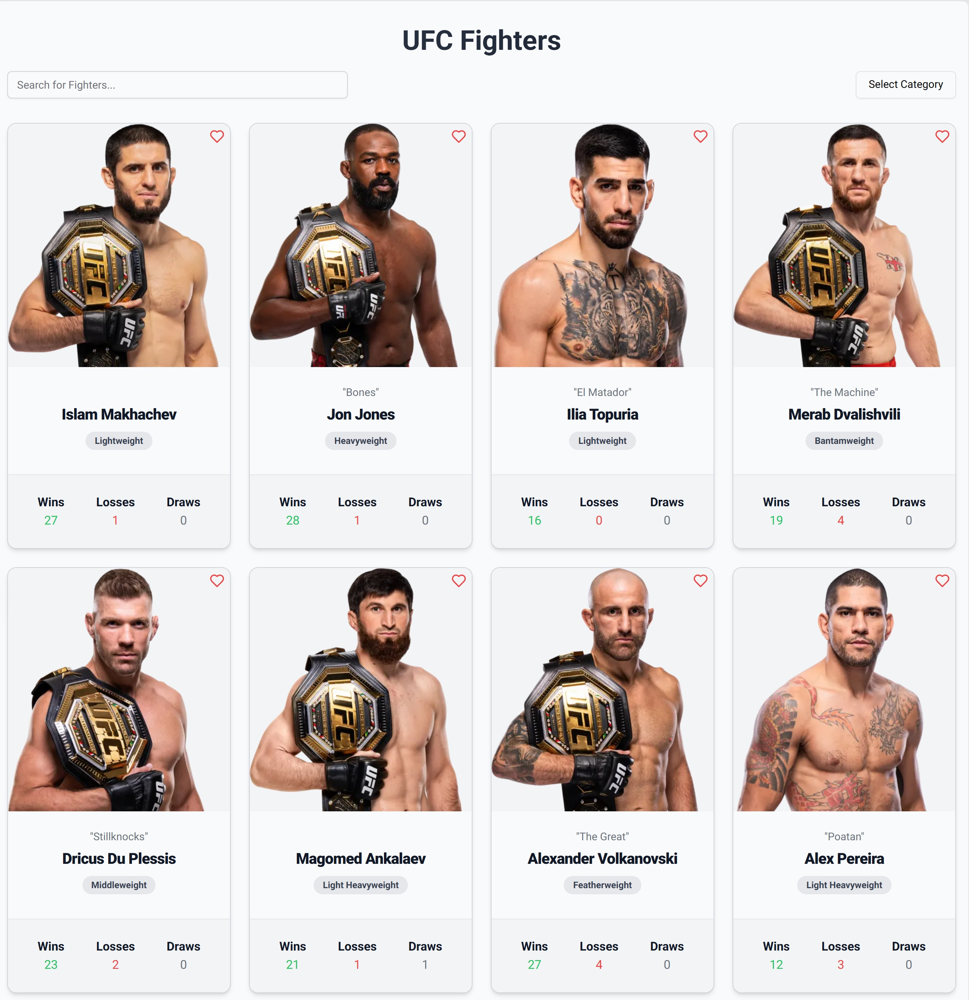
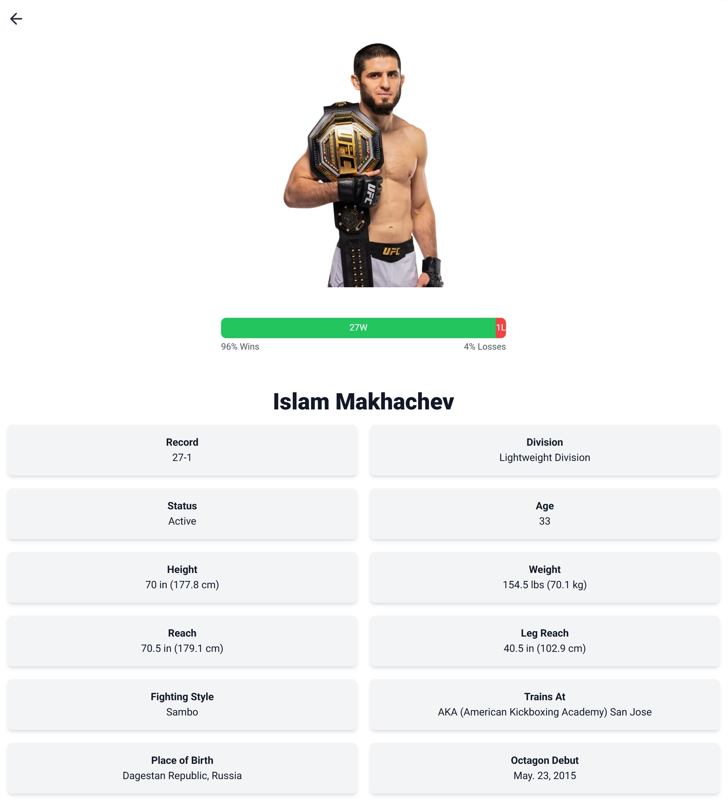
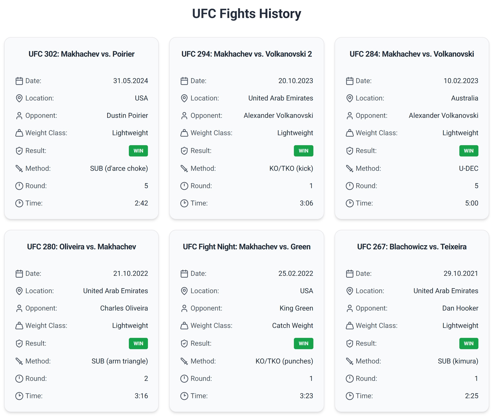

## Fight Tracker

Fight Tracker is a modern web application designed to deliver an outstanding experience for tracking top MMA fighters, rankings, events and news.

- **90%+ test coverage** achieved with **Jest** and **React Testing Library**, ensuring high reliability and maintainability
- Built with **Next.js 15**, utilizing its advanced features for optimal performance, scalability and a modern development experience
- Fully typed with **TypeScript** and validated with **Zod** for robust type safety and runtime validation
- Utilizes **Tailwind CSS** for rapid and responsive design, **Radix UI** for accessible components, **Shadcn** for enhanced styling capabilities and **Framer Motion** for smooth animations, ensuring a visually appealing and interactive user experience
- Implements modern best practices for clean, maintainable and scalable code, including **Server Actions**, **Client-side and Server-side Fetching**, **Caching**, **Performance and Image Optimization**, **Error Handling**, **SEO**, **Accessibility**, **DRY**, **KISS**



## Installation

```bash
$ git clone https://github.com/danielprzybytniewski/fight-tracker.git
$ npm install
$ cp .env.example .env
$ cp .env.test.example .env.test
```

## Running the app

```bash
# Development mode
$ npm run dev

# Production build
$ npm run build
$ npm run start
```

## Running the tests

```bash
# Run all tests
$ npm run test

# Watch mode for tests
$ npm run test:watch

# Test coverage report
$ npm run test:coverage
```

## License

This project is licensed under the MIT License.

## Screenshots







